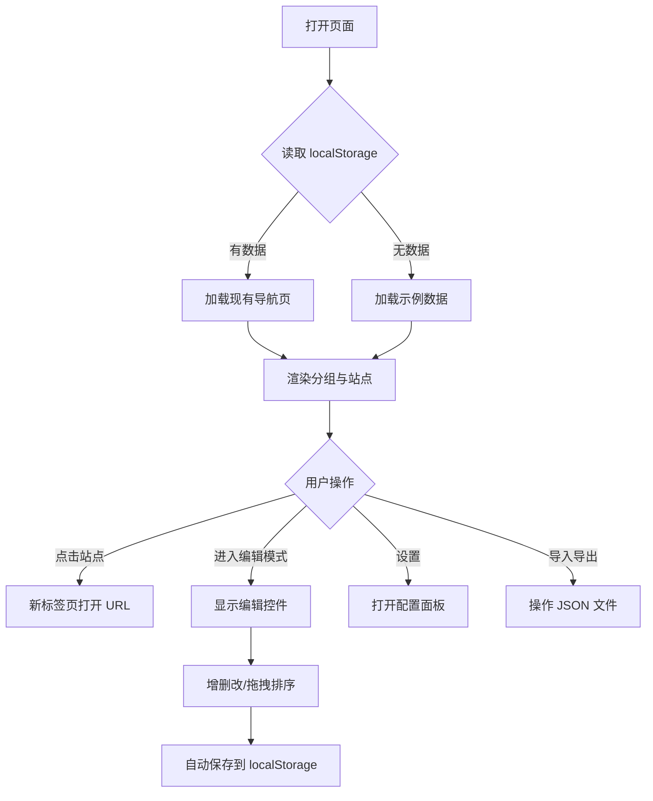

# 站点导航产品需求文档（PRD）

## 1. 产品概述

站点导航是一款基于浏览器的个人网站收藏与管理工具，采用高密度卡片式布局，支持多导航页、分组管理、站点收藏、拖拽排序、视觉特效与数据导入导出。所有数据持久化保存在浏览器本地存储中，无需后端服务器即可独立运行。

目标用户：需要快速访问大量常用网站、重视信息密度和操作效率的个人用户。产品核心目标是用最小空间承载最多信息，减少页面留白，同时保持视觉清晰和操作流畅。

---

## 2. 核心功能

### 2.1 用户角色

| 角色 | 使用方式 | 核心权限 |
|------|----------|----------|
| 普通用户 | 本地打开页面即可使用 | 浏览、编辑、导入导出、配置显示方式 |

### 2.2 功能模块

1. **顶部标题栏**：应用标题、导航页切换器、编辑/设置/导入/导出操作按钮。
2. **导航页管理**：创建、编辑、删除、切换多个导航页，最多 10 个。
3. **分组管理**：添加、编辑、删除分组，拖拽排序分组。
4. **站点管理**：添加、编辑、删除站点，拖拽排序和跨分组移动站点，自动获取站点图标。
5. **编辑模式**：统一的编辑状态，所有管理操作仅在编辑模式下可用。
6. **显示配置**：设置导航页展示方式、每行分组数量、语言、站点卡片内容与布局。
7. **数据导入导出**：支持 JSON 文件的备份、迁移和覆盖。
8. **视觉特效**：高亮、闪烁、跳动、抖动四种卡片特效，可叠加。

### 2.3 页面与模块详情

| 页面 | 模块 | 功能描述 |
|------|------|----------|
| 主页面 | 顶部标题栏 | 固定顶部，包含标题、导航页切换、操作按钮 |
| 主页面 | 分组网格 | 按配置列数展示分组卡片，内部为站点网格 |
| 主页面 | 编辑控制区 | 编辑模式下显示分组和站点的操作按钮与拖拽手柄 |
| 模态框 | 导航页表单 | 添加/编辑导航页的名称和主题色 |
| 模态框 | 分组表单 | 添加/编辑分组的名称和颜色 |
| 模态框 | 站点表单 | 添加/编辑站点的名称、URL、描述、图标、特效 |
| 模态框 | 设置面板 | 配置显示选项和语言 |
| 模态框 | 导入导出面板 | 选择导出页面、选择导入模式 |

---

## 3. 核心流程

用户首次打开页面时，系统从 localStorage 读取数据。若无历史数据，则加载内置示例数据。用户可在非编辑模式下点击站点卡片直接访问网站；进入编辑模式后，可进行导航页、分组、站点的增删改查和拖拽排序。所有修改实时保存到 localStorage。用户可通过导入导出功能迁移数据。

---

## 4. 用户界面设计

### 4.1 设计风格

采用高密度「控制台/仪表盘」风格，信息紧凑但层次清晰。

- **主色调**：深灰/暗色背景（`#0f0f11`），减少眼部疲劳；分组颜色作为卡片标题和边框强调色。
- **辅助色**：金色（高亮）、红色（闪烁）、蓝色（跳动）、紫色（抖动）用于特效。
- **按钮风格**：小尺寸圆角按钮（`border-radius: 6px`），扁平化，悬停时轻微提亮。
- **字体**：
  - 标题使用 `Space Grotesk` 或等效几何无衬线字体，字形锐利现代；
  - 正文使用 `Inter` 或系统无衬线字体，确保小字号可读性；
  - 全局字号偏小：标题 `16-18px`，分组名 `13-14px`，站点名 `12-13px`，辅助信息 `11px`。
- **布局风格**：顶部固定标题栏 + 下方响应式网格分组卡片。分组内部为站点卡片网格。
- **图标**：使用 Lucide React 线性图标，尺寸 14-16px，保持克制。

### 4.2 密度与留白控制

- 分组卡片内边距 `12-16px`，站点卡片内边距 `8-10px`。
- 站点卡片间距 `8px`，分组间距 `12px`。
- 默认每行 4 个分组（可在设置中调整 1-6 个）。
- 站点卡片默认紧凑布局，图标与名称同行显示，最小化高度。
- 地址和描述默认隐藏，用户可主动开启以进一步控制密度。

### 4.3 页面设计概述

| 页面 | 模块 | UI 元素 |
|------|------|---------|
| 主页面 | 标题栏 | 深色背景、应用标题、导航页下拉/标签、操作按钮 |
| 主页面 | 分组卡片 | 彩色标题条、站点网格、编辑模式下显示操作按钮 |
| 主页面 | 站点卡片 | 小图标 + 站点名、特效边框/动画、悬停浮起 |
| 模态框 | 表单 | 小字号标签、紧凑输入框、颜色选择器、图标预览 |
| 模态框 | 设置 | 选项列表、下拉选择、开关/复选框 |

### 4.4 响应式设计

- 桌面优先，默认每行 4 个分组。
- 当视口宽度小于 1280px 时，每行 3 个分组。
- 当视口宽度小于 1024px 时，每行 2 个分组。
- 当视口宽度小于 640px 时，每行 1 个分组。
- 站点卡片网格在分组内响应：默认 4-6 列，随宽度递减。

### 4.5 动效与交互

- **页面加载**：分组和站点按顺序轻微淡入上滑（stagger 30ms）。
- **悬停状态**：站点卡片 `translateY(-2px)` + 阴影加深，过渡 150ms。
- **编辑模式切换**：编辑按钮颜色变化，编辑控件淡入。
- **特效动画**：纯 CSS keyframes 实现，不阻塞交互：
  - 高亮：45° 光线扫过 + 金色边框。
  - 闪烁：红色脉冲缩放。
  - 跳动：上下弹跳。
  - 抖动：左右摇摆。

---

## 5. 数据存储

所有数据保存在浏览器 localStorage：

- `siteNavigatorData`：导航页、分组、站点的完整数据。
- `siteNavigatorConfig`：显示配置（导航页展示方式、每行分组数、卡片显示内容、布局等）。
- `siteNavigator_language`：当前语言（`zh-CN` 或 `en`）。
- `siteNavigator_currentPageId`：当前选中的导航页 ID。

---

## 6. 非功能性需求

- **性能**：页面渲染数据量较大时应保持流畅，使用虚拟化或不使用复杂重渲染。
- **兼容性**：支持现代 Chrome、Edge、Firefox、Safari。
- **可访问性**：按钮和表单元素具备适当焦点状态与 ARIA 标签。
- **离线可用**：无需网络即可使用，图标获取需联网。
