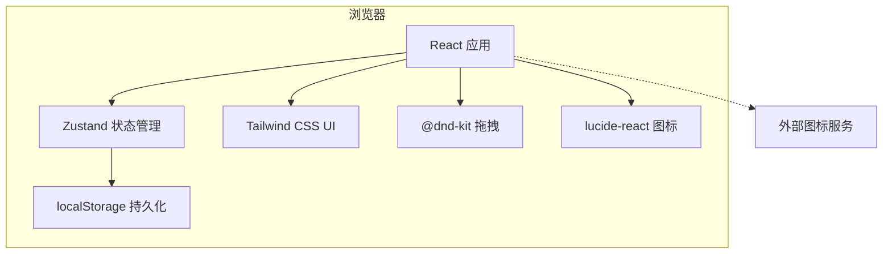

# 站点导航技术架构文档

## 1. 架构设计

采用纯前端单页应用架构，所有业务逻辑、状态管理和数据持久化均在浏览器端完成，无需后端服务。



---

## 2. 技术栈

| 层级 | 技术 | 说明 |
|------|------|------|
| 前端框架 | React 18 + TypeScript | 组件化开发，类型安全 |
| 构建工具 | Vite | 快速开发服务器与打包 |
| 样式方案 | Tailwind CSS 3 | 原子化 CSS，快速实现高密度界面 |
| 状态管理 | Zustand | 轻量级全局状态管理 |
| 拖拽排序 | @dnd-kit/core + @dnd-kit/sortable | 分组与站点的拖拽排序 |
| 图标 | lucide-react | 统一线性图标 |
| 国际化 | 自定义 hooks（useI18n） | 中英文切换 |
| 数据存储 | localStorage | 浏览器本地持久化 |

---

## 3. 路由定义

本项目为单页应用，所有功能在主页面内通过状态切换完成，无需多路由。

| 路由 | 用途 |
|------|------|
| `/` | 站点导航主页面，包含标题栏、分组网格、站点卡片、模态框 |

---

## 4. 数据模型

### 4.1 类型定义

```typescript
interface Site {
  id: string;
  name: string;
  url: string;
  description?: string;
  icon?: string;
  effects: {
    highlight?: boolean;
    blink?: boolean;
    bounce?: boolean;
    shake?: boolean;
  };
}

interface Group {
  id: string;
  name: string;
  color: string;
  sites: Site[];
}

interface Page {
  id: string;
  name: string;
  color?: string;
  groups: Group[];
}

interface AppData {
  pages: Page[];
}

interface AppConfig {
  pageDisplay: 'dropdown' | 'tabs';
  groupsPerRow: number;
  showIcon: boolean;
  showName: boolean;
  showUrl: boolean;
  showDescription: boolean;
  cardLayout: 'horizontal' | 'vertical' | 'compact';
}
```

### 4.2 localStorage 键

| 键 | 用途 |
|----|------|
| `siteNavigatorData` | 存储 `AppData` |
| `siteNavigatorConfig` | 存储 `AppConfig` |
| `siteNavigator_language` | 存储语言代码 |
| `siteNavigator_currentPageId` | 存储当前页面 ID |

---

## 5. 项目结构

```
/
├── public/
│   └── (静态资源)
├── src/
│   ├── components/
│   │   ├── Header.tsx
│   │   ├── PageSelector.tsx
│   │   ├── GroupCard.tsx
│   │   ├── SiteCard.tsx
│   │   ├── SiteForm.tsx
│   │   ├── GroupForm.tsx
│   │   ├── PageForm.tsx
│   │   ├── SettingsPanel.tsx
│   │   ├── ImportExportPanel.tsx
│   │   ├── Modal.tsx
│   │   └── EffectBadge.tsx
│   ├── hooks/
│   │   ├── useI18n.ts
│   │   └── useLocalStorage.ts
│   ├── store/
│   │   └── useAppStore.ts
│   ├── utils/
│   │   ├── sampleData.ts
│   │   ├── iconFetch.ts
│   │   └── helpers.ts
│   ├── types/
│   │   └── index.ts
│   ├── App.tsx
│   ├── main.tsx
│   └── index.css
├── .trae/documents/
│   ├── PRD.md
│   └── Technical-Architecture.md
├── package.json
├── tsconfig.json
├── vite.config.ts
├── tailwind.config.js
└── postcss.config.js
```

---

## 6. 关键实现策略

### 6.1 状态管理

使用 Zustand 维护应用状态，包括当前页面、编辑模式、打开模态框、配置等。数据变更时同步写入 localStorage。

### 6.2 拖拽排序

- 分组排序：使用 @dnd-kit/sortable 在分组网格容器上实现。
- 站点排序：在每个分组内部实现站点拖拽；跨分组移动时检测放置目标分组，更新站点所属分组和顺序。

### 6.3 图标获取

站点表单中提供「获取图标」按钮，依次尝试多个图标服务（Clearbit、IconHorse、Google Favicon 等），第一个成功返回的图标 URL 被使用。

### 6.4 特效实现

所有视觉特效使用 Tailwind 自定义 CSS keyframes 和类名实现，避免运行时 JavaScript 动画，保证性能。

### 6.5 响应式布局

使用 Tailwind 的响应式前缀（`sm:`、`md:`、`lg:`、`xl:`）控制分组网格列数和站点卡片网格列数。

---

## 7. 依赖列表

```json
{
  "dependencies": {
    "react": "^18.x",
    "react-dom": "^18.x",
    "zustand": "^4.x",
    "@dnd-kit/core": "^6.x",
    "@dnd-kit/sortable": "^8.x",
    "@dnd-kit/utilities": "^3.x",
    "lucide-react": "^0.x",
    "clsx": "^2.x",
    "tailwind-merge": "^2.x"
  },
  "devDependencies": {
    "@types/react": "^18.x",
    "@types/react-dom": "^18.x",
    "typescript": "^5.x",
    "vite": "^5.x",
    "tailwindcss": "^3.x",
    "postcss": "^8.x",
    "autoprefixer": "^10.x"
  }
}
```
